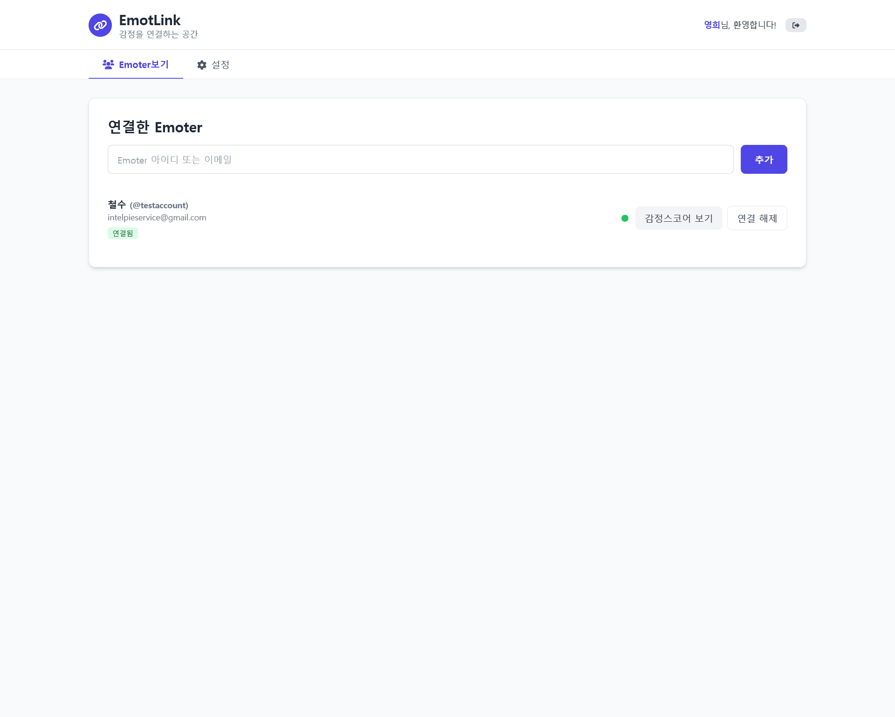
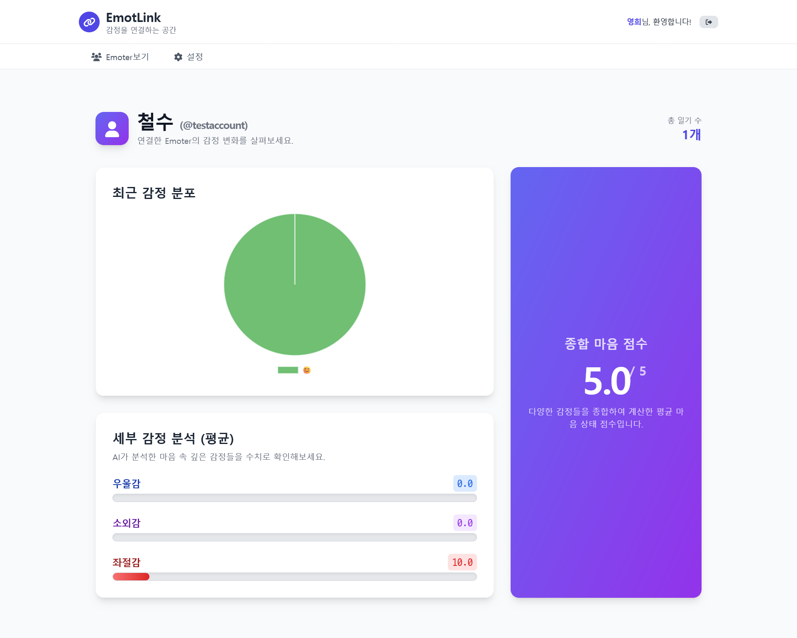

<h1>EmotLink</h1>

대화로 하루를 정리하고, 스스로를 돌보는 감정 다이어리 서비스입니다. 
Emoter(사용자)는 AI와 대화하며 감정과 사건을 정리하고, Linker(보호자/상담자)는 연결이 승인된 사용자에 한해 변화 지표를 살펴볼 수 있습니다. 음성 입력(STT), 이메일 인증, 역할 기반 접근 제어를 포함하여 웹/모바일 환경에서 자연스럽게 사용하도록 설계했습니다.

 

Reflect on your day through conversation and take care of yourself with an emotion diary. 
Emoters talk with AI to organize feelings and events. Linkers (guardians/counselors) can review trends only for users who have approved a connection. The experience is designed to feel natural on web and mobile, with voice input (STT), email verification, and role‑based access control.

 

 

 

## 🔎 Showcase
|  **🔗 Link** | **📊 Inspect** | 
| :---: | :---: |
|  |  |
